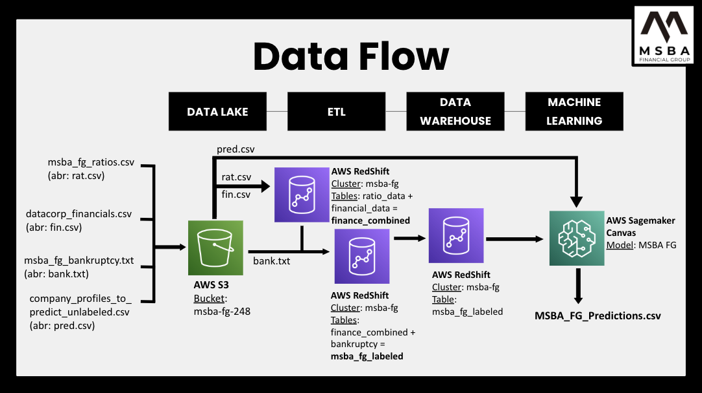
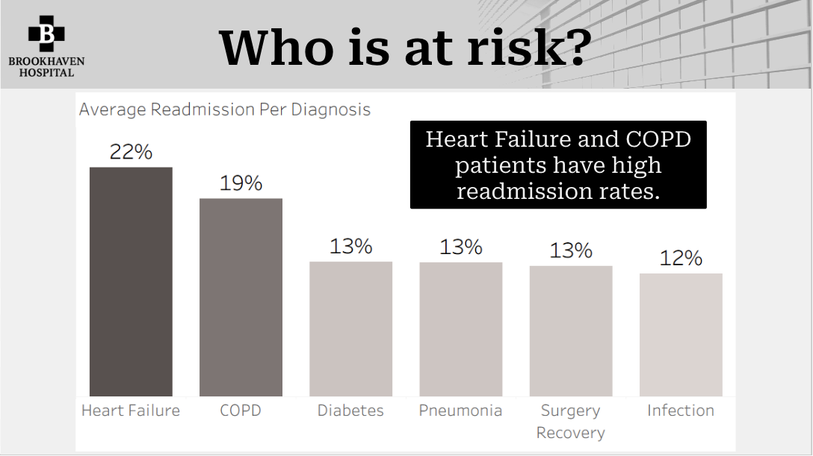
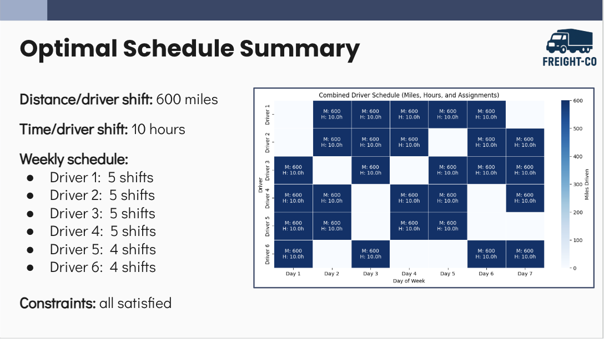
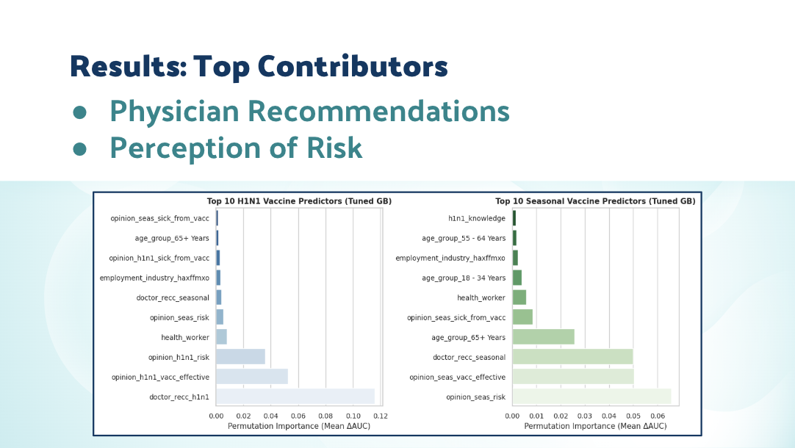

# Projects

Below are selected data analytics and visualization projects showcasing my work.

---

## Cloud-Native Data Architecture

**Tools:** AWS S3, AWS Redshift, AWS Sagemaker Canvas

**Focus:** Probability and Predictive Factors of Bankruptcy

**Key Insights:**
- Long-term sustainable EPS may be associated with future bankruptcy
- The model predicts bankruptcy likelihood with over 80% certainty
- Companies who were predicted to go bankrupt have higher current liability:equity and current liability:assets ratios

[View interactive dashboard](LINK_HERE)

---

## Patient Readmissions Analysis

**Tools:** Snowflake, Tableau 

**Focus:** Analysis of Specific Factors Contributing to Readmission Rates

**Key Insights:**
- Readmission rates are highest among Heart Failure and COPD patients
- When a follow-up appointment is scheduled, Heart Failure and COPD patient readmission rates decreased by 25% and 24.5%, respectively
- ⅓ of COPD and Heart Failure patients are currently recommended at home health care plans

[View report](LINK_HERE)

---

## Python Optimization

**Tools:** Python, ChatGPT, Gemini

**Focus:** Truck Driver Scheduling

**Key Insight:**
- Identified optimal truck driver schedule, abiding by all constraints

**Next Steps:**
- Consider variation in geographic road speeds
- Implement optimal routes based on location

[View report](LINK_HERE)

---

## Flu Vaccine Uptake Analysis

**Tools:** Python

**Focus:** Prediction of factors contributing to flu vaccine uptake

**Key Insights:**
- Top contributors to flu vaccine uptake were a physicians recommendation and the patient perception of risk

**Next Steps:**
- A/B testing for messaging
- Collaboration with Public Health Organizations

[View report](LINK_HERE)
